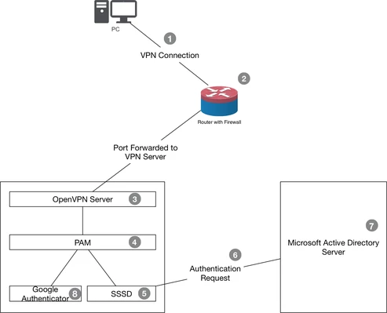

[部署openvpn](https://www.xxlaila.cn/2020/03/10/openvpn%E9%83%A8%E7%BD%B2/)

[Refer2](https://velenux.wordpress.com/2019/03/12/openvpn-with-google-2-factor-authentication-on-centos-7/)

[Refer3](https://my.oschina.net/HeAlvin/blog/2051350)

### 安装依赖包

```
yum install -y gcc gcc-c++ auotmake auotconf make libpng-devel libtool wget git
yum -y --enablerepo=epel install openvpn easy-rsa 
```

创建一个`vars`文件设置证书的一些默认值

```
cp -a /usr/share/easy-rsa/3.0.8/ /etc/openvpn/easy-rsa
[root@kolla-k8s-manager ~]# cat >/etc/openvpn/easy-rsa/vars <<EOF
set_var EASYRSA_REQ_COUNTRY    "Beijing"
set_var EASYRSA_REQ_PROVINCE    "Beijing"
set_var EASYRSA_REQ_CITY    "Beijing City"
set_var EASYRSA_REQ_ORG    "kolla.org"
set_var EASYRSA_REQ_EMAIL    "kolla@Beijing.org"
set_var EASYRSA_REQ_OU        "kolla IT"
set_var EASYRSA_KEY_SIZE    4096
set_var EASYRSA_ALGO        rsa
set_var EASYRSA_CA_EXPIRE    3650
set_var EASYRSA_CERT_EXPIRE    3650
set_var EASYRSA_CRL_DAYS    3650
set_var EASYRSA_DIGEST        "sha256"
EOF
```

### 证书文件签发

```
cd /etc/openvpn
./easy-rsa/easyrsa init-pki #Passw0rd!**_
./easy-rsa/easyrsa build-ca
./easy-rsa/easyrsa gen-dh >/dev/null 2>&1 &
openvpn --genkey --secret pki/ta.key
./easy-rsa/easyrsa build-server-full vpn.kolla.org nopass
./easy-rsa/easyrsa gen-crl
```

### Google Authenticator pam模块

在继续配置OpenVPN服务器之前，我们先安装Google Authenticator pam模块

```
yum -y install pam-devel
cd /opt
git clone https://github.com/google/google-authenticator-libpam
cd google-authenticator-libpam
./bootstrap.sh
./configure
make && make install
```

```
cat >/etc/pam.d/openvpn<<EOF
# google auth
auth        required    /usr/local/lib/security/pam_google_authenticator.so  forward_pass
account     required    pam_nologin.so
account     include     system-auth use_first_pass
password    include     system-auth
session     include     system-auth
EOF
```

OpenVPN将在内部使用它来针对本地用户测试用户。稍后我们将介绍如何创建用户以及如何登录用户。

### OpenVPN服务器配置

现在，我们创建一个客户端配置目录（`ccd`），以便将来对安装进行验证，以防万一我们需要特定客户端的配置，然后检查服务器配置

```
mkdir ccd
cat > /etc/openvpn/server.conf<<EOF
# 2FA
plugin /usr/lib64/openvpn/plugins/openvpn-plugin-auth-pam.so openvpn
 
 
# tcp
port 1194
proto tcp
dev tun
persist-key
persist-tun
keepalive 10 900
comp-lzo
reneg-sec 10800
 
 
# log
verb 3
mute 10
log-append /var/log/openvpn.log
status openvpn-status.log
 
 
# crypto
cipher AES-256-CFB8
auth SHA512
tls-auth pki/ta.key 0
tls-cipher TLS-DHE-RSA-WITH-AES-256-CBC-SHA
 
 
# certs
ca pki/ca.crt
cert pki/issued/vpn.kolla.org.crt
key pki/private/vpn.kolla.org.key
dh pki/dh.pem
crl-verify pki/crl.pem
 
 
# networking
server 10.1.1.0 255.255.255.0
push "route 192.168.0.0 255.255.255.0"
 
 
# clients
ifconfig-pool-persist ipp.txt
client-config-dir ccd
max-clients 100
EOF
```

## OpenVPN客户端配置模板

客户端配置将如下所示（为每个客户端定制）：

```
cat >/etc/openvpn/template-client.conf<<EOF
# logging on separate file if required
# log-append /var/log/openvpn-PLATFORM_NAME-CLIENT_NAME.log
 
client
 
# vpn concentrator
remote vpn.kolla.org 1194
 
 
# certificates, with path relative to the config file
ca PLATFORM_NAME.ca.crt
cert CLIENT_NAME.crt
key CLIENT_NAME.key
auth-user-pass
auth-nocache
 
 
# generic stuff
dev tun
proto tcp
nobind
persist-key
persist-tun
nobind
comp-lzo
verb 3
mute 10
reneg-sec 10800
 
 
# crypto
cipher AES-256-CFB8
tls-auth PLATFORM_NAME.ta.key 1
tls-cipher TLS-DHE-RSA-WITH-AES-256-CBC-SHA
remote-cert-tls server
auth SHA512
script-security 2
EOF
```

如您所见，我们使用`PLATFORM_NAME`和`CLIENT_NAME`作为占位符，可以轻松地为每个客户端配置。

### 创建一个新用户

现在我们需要创建一个新用户来测试一切正常。我们称之为`client0001`。

```
cat >/etc/openvpn/create_user.sh<<EOF
# set the variables we'll use later
NAME_CLIENT="client0001"
DIR_CLIENT="/etc/openvpn/clients/${NAME_CLIENT}"
 
# create the certificate and key
cd "/etc/openvpn"
/etc/openvpn/easy-rsa/easyrsa build-client-full "${NAME_CLIENT}" nopass
 
# create a directory to save all the files
mkdir -p "${DIR_CLIENT}"
 
# copy certificate, key, tls auth and CA
cp -v "/etc/openvpn/pki/ca.crt" "$DIR_CLIENT/vpn.kolla.org.ca.crt"
cp -v "/etc/openvpn/pki/ta.key" "$DIR_CLIENT/vpn.kolla.org.ta.key"
cp -v "/etc/openvpn/pki/issued/${NAME_CLIENT}.crt" "$DIR_CLIENT/"
cp -v "/etc/openvpn/pki/private/${NAME_CLIENT}.key" "$DIR_CLIENT/"
 
# copy and customize the client configuration
cp -v "/etc/openvpn/template-client.conf" "${DIR_CLIENT}/${NAME_CLIENT}.ovpn"
sed -i "s#CLIENT_NAME#${NAME_CLIENT}#g" "${DIR_CLIENT}/${NAME_CLIENT}.ovpn"
sed -i "s#PLATFORM_NAME#vpn.kolla.org#g" "${DIR_CLIENT}/${NAME_CLIENT}.ovpn"
 
# create a new local user
PASS=$(head -n 4096 /dev/urandom | tr -dc a-zA-Z0-9 | cut -b 1-20)
useradd -m "${NAME_CLIENT}"
echo "$PASS" | passwd --stdin ${NAME_CLIENT}
echo "$PASS" > ${DIR_CLIENT}/sshpass.txt
 
# run the google authenticator as the local user and save the code
su ${NAME_CLIENT} -c "/usr/local/bin/google-authenticator -C -t -f -D -r 3 -Q UTF8 -R 30 -w3" > ${DIR_CLIENT}/authenticator_code.txt
EOF
```

```
[root@kolla-k8s-manager openvpn]# cat ${DIR_CLIENT}/authenticator_code.txt
Warning: pasting the following URL into your browser exposes the OTP secret to Google:
  https://www.google.com/chart?chs=200x200&chld=M|0&cht=qr&chl=otpauth://totp/client0001@kolla-k8s-manager.local%3Fsecret%3DI3ESXQERZR***%26issuer%3Dkolla-k8s-manager.local
Your new secret key is: I3ESXQERZRQZ*****
Your verification code for code 1 is ****
Your emergency scratch codes are:
  68324434
  ********
  33976114
  95327758
  40496179
```

开启内核路由转发功能

```
echo "net.ipv4.ip_forward = 1" >>/etc/sysctl.conf
sysctl -p
```

启动openvpn

```
systemctl restart openvpn@server
systemctl enable openvpn@server
```


### Freeipa Docker 服务部署

**官网参考连接**：https://hub.docker.com/r/freeipa/freeipa-server/

1. `FreeIPA` 是集中认证和权限管理服务器系统，包含 `WEB UI` 管理界面，界面访问地址需要全域访问（即不能通过IP地址直接访问界面），需要将地址与 IP 在 `/etc/hosts` 里面映射。

```
more /etc/docker/daemon.json
{
  "registry-mirrors": ["http://hub-mirror.c.163.com"],
  # 解决ipv6相关报错
  "ipv6": true,
  "fixed-cidr-v6": "fd00::/80"
}

[root@ipa ~]# cat /etc/sysctl.conf
net.ipv4.ip_forward=1
net.ipv6.conf.all.disable_ipv6=1
net.ipv6.conf.default.disable_ipv6=1
net.ipv6.conf.ens19.disable_ipv6=1
# 注意：如果遇到 IPV6 问题，可能需要打开 IPV6
net.ipv6.conf.lo.disable_ipv6 =0

hostnamectl set-hostname ipa.kolla.top
[root@ipa ~]# cat /etc/hosts
127.0.0.1   localhost localhost.localdomain localhost4 localhost4.localdomain4 ipa.kolla.top
::1         localhost localhost.localdomain localhost6 localhost6.localdomain6
```

```
# 在宿主机上创建 FreeIPA 数据目录
mkdir /var/lib/ipa-data

docker run --name freeipa-server --privileged=true -p 8000:80 -p 389:389 -p 8443:443 -ti -h ipa.kolla.top -v /sys/fs/cgroup:/sys/fs/cgroup:ro --tmpfs /run --tmpfs /tmp -v /var/lib/ipa-data:/data:Z --restart=on-failure:3 freeipa/freeipa-server:centos-8-4.8.7 --no-ntp
....
Continue to configure the system with these values? [no]:yes
....
自动配置的时间可能有点久
FreeIPA server configured.
```

添加域名解析后，可使用 `https://ipa.kolla.top/ipa/ui` 登录

admin 账户登录，密码为最开始配置 freeipa-server 时设置的密码
假设某一个用户 test 设置了 OTP token， 那登录密码为： 用户密码+token密码
可在 IPA server 下的 API browser 查看操作 API：

### FreeIPA 服务器脚本批量用户操作

#### 1、进入 FreeIPA 容器

```shell
#freeipa 为 freeipa-server 容器的 name
docker exec -it freeipa bash
12
```

#### 2、登录 admin 用户，才可进行操作

```shell
#这里 admin 的登录密码就是最开始配置 freeipa-server 时设置的密码
[root@freeipa /]$ kinit admin
Password for admin@FREEIPA.EXAMPLE.COM: ********
123
```

#### 3、添加用户脚本 addUsersAndToken.sh

```shell
#!/bin/bash
# 添加用户并设置OTP Token
# 设置新增用户的初始密码
password=freeipa
if [ -f otplist ]; then
        rm -rf otplist*
fi
if [ -f users.txt ]; then
starttime=`date +'%Y-%m-%d %H:%M:%S'`
start_seconds=$(date --date="$starttime" +%s);
for line in `cat users.txt`
#例如line = test/测试/test@generalichina.com/保险公司用户
do
        login=${line%%/*}
        str=${line#*/}
        str2=${str%/*}
        name=${str2%/*}
        email=${str2##*/}
        title=${line##*/}
        /usr/bin/expect<<-EOF
        set timeout 10
        spawn ipa user-add ${login} --first ${name} --last ${name} --title ${title} --cn ${name} --displayname ${name} --email ${email}  --user-auth-type otp --password
        expect "Password:"
        send "$password\r"
        expect "Enter Password again to verify:"
        send "$password\r"
        expect eof
        EOF
        ipa otptoken-add --type=totp --not-before=20190101000000Z --not-after=22000101000000Z --owner=${login} --algo=sha512 --digits=6 --interval=60 --no-qrcode --desc="Token for ${name}" >> ./otplist
        #echo "-----Add Token success!  ${login}-${name}"
done
cat otplist | grep URI | awk -F 'URI:' '{print $2}' >> otplist.txt
else
        echo "Error! users.txt not exists!"
fi
endtime=`date +'%Y-%m-%d %H:%M:%S'`
end_seconds=$(date --date="$endtime" +%s);
echo "本次运行时间： "$((end_seconds-start_seconds))"s"
1234567891011121314151617181920212223242526272829303132333435363738
```

这里需要用户列表文件 **users.txt**
内容格式例如：**test/测试/test@example.com/系统用户**

**addUsersAndToken.sh** 脚本执行完后，会将 **token** 信息返回到 **otplist.txt** 文件内。

#### 4、批量删除用户脚本 delUsers.sh

```shell
#!bin/bash
#查询用户输出到 userlist.txt
ipa user-find | grep User | awk -F ':' '{print $2}' >> userlist.txt
#排除不可删除的用户，例如 admin
if [ -f ./userlist.txt ];
then
        cat userlist.txt | sed '/admin/d' > newuserlist.txt
        rm -f userlist.txt
fi
if [ -f newuserlist.txt ];
then
        for username in `cat newuserlist.txt`
        do
                echo "删除用户 $username"
                ipa user-del $username
        done
        rm -f newuserlist.txt
fi
123456789101112131415161718
```

#### 5、批量删除用户 token 脚本 delToken.sh

```shell
#!bin/bash
ipa otptoken-find | grep Unique | awk -F ':' '{print $2}' >> tokenlist.txt
if [ -f ./tokenlist.txt ]; then
for id in `cat tokenlist.txt`
do
        ipa otptoken-del ${id}
done
rm -rf tokenlist.txt
fi
```