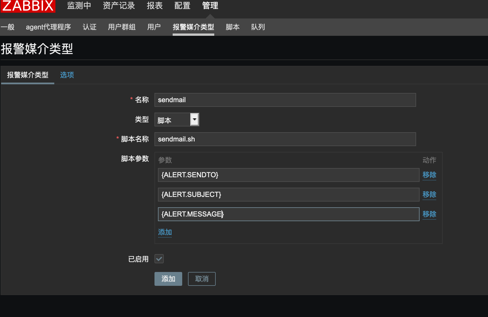
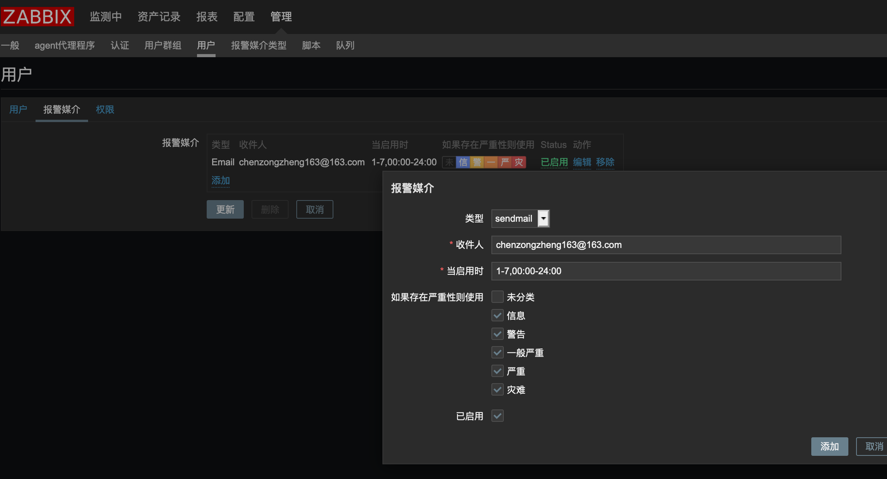

## 1.安装MySQL

部署文档：https://dev.mysql.com/doc/mysql-yum-repo-quick-guide/en/

```shell
~]# yum -y install yum-utils 
~]# rpm -ivh https://dev.mysql.com/get/mysql80-community-release-el7-1.noarch.rpm
~]# yum-config-manager --disable mysql80-community
~]# yum-config-manager --enable mysql57-community
~]# yum install mysql-community-server
~]# systemctl start mysqld
~]# systemctl status mysqld
~]# grep 'temporary password' /var/log/mysqld.log
~]# mysql -uroot -p
mysql> ALTER USER 'root'@'localhost' IDENTIFIED BY 'Zabbix2020!';
```

优化mysql配置

```shell
~]# cat > /etc/my.cnf <<eof
[mysql]
socket = /var/lib/mysql/mysql.sock
[mysqld]
user = mysql
port = 3306
datadir = /var/lib/mysql
socket = /var/lib/mysql/mysql.sock
bind-address = 0.0.0.0
pid-file = /var/run/mysqld/mysqld.pid
character-set-server = utf8
collation-server = utf8_general_ci
log-error = /var/log/mysqld.log

max_connections = 10240
open_files_limit = 65535
innodb_buffer_pool_size = 1G
innodb_flush_log_at_trx_commit = 2
innodb_log_file_size = 256M
eof
```

## 2.安装php

```shell
安装依赖包:
~]# yum install -y gcc gcc-c++ make gd-devel libxml2-devel \
libcurl-devel libjpeg-devel libpng-devel openssl-devel \
libxslt-devel

安装PHP:
~]# wget http://mirrors.sohu.com/php/php-5.6.36.tar.gz
~]# tar zxf php-5.6.36.tar.gz
~]# cd php-5.6.36
~]# ./configure --prefix=/usr/local/php \
--with-config-file-path=/usr/local/php/etc \
--enable-fpm --enable-opcache \
--with-mysql --with-mysqli  \
--enable-session --with-zlib --with-curl --with-gd \
--with-jpeg-dir --with-png-dir --with-freetype-dir \
--enable-mbstring --enable-xmlwriter --enable-xmlreader \
--enable-xml --enable-sockets --enable-bcmath --with-gettext
~]# make -j 8 && make install
~]# cp php.ini-production /usr/local/php/etc/php.ini
~]# cp sapi/fpm/php-fpm.conf /usr/local/php/etc/php-fpm.conf
~]# cp sapi/fpm/init.d.php-fpm /etc/init.d/php-fpm
~]# cp sapi/fpm/php-fpm.service /usr/lib/systemd/system/
~]# cat > /usr/lib/systemd/system/php-fpm.service <<eof
[Unit]
Description=The PHP FastCGI Process Manager
After=syslog.target network.target

[Service]
Type=simple
PIDFile=/usr/local/php/var/run/php-fpm.pid
ExecStart=/usr/local/php/sbin/php-fpm --nodaemonize --fpm-config /usr/local/php/etc/php-fpm.conf
ExecReload=/bin/kill -USR2 $MAINPID

[Install]
WantedBy=multi-user.target
eof

~]# systemctl daemon-reload
~]# systemctl start php-fpm
~]# systemctl enable php-fpm

```

## 3.安装nginx

```shell
~]# wget http://nginx.org/download/nginx-1.9.9.tar.gz
~]# yum install gcc pcre-devel openssl-devel –y
~]# useradd -M -s /sbin/nologin nginx
~]# tar -xf nginx-1.9.9.tar.gz 
~]# cd nginx-1.9.9
~]# ./configure --prefix=/usr/local/nginx --user=nginx --group=nginx --with-http_ssl_module --with-http_stub_status_module
~]# make && make install
~]# chown nobody -R /usr/local/nginx/
~]# vi /usr/local/nginx/conf/nginx.conf
~]#id        /var/run/nginx.pid;

~]# cat > /usr/lib/systemd/system/nginx.service<<eof
[Unit]
Description=The NGINX HTTP and reverse proxy server
After=syslog.target network.target remote-fs.target nss-lookup.target

[Service]
Type=forking
PIDFile=/var/run/nginx.pid
ExecStartPre=/usr/local/nginx/sbin/nginx -t
ExecStart=/usr/local/nginx/sbin/nginx
ExecReload=/usr/local/nginx/sbin/nginx -s reload
ExecStop=/bin/kill -s QUIT $MAINPID
PrivateTmp=true

[Install]
WantedBy=multi-user.target
eof

~]# systemctl daemon-reload

```

## 4.部署Zabbix Server

```shell
https://www.zabbix.com/download_sources

导入表结构：
~]# cd /opt/src/zabbix-4.0.0/database/mysql/
~]# mysql -uroot -p
mysql> use zabbix
mysql> source schema.sql;
mysql> source images.sql;
mysql> source data.sql;

```

```shell
~]# yum install libxml2-devel libcurl-devel libevent-devel net-snmp-devel mysql-community-devel java-1.8.0-openjdk java-1.8.0-openjdk-devel -y
~]# useradd  -M zabbix -s /sbin/nologin
~]# cd zabbix-4.0.0
~]# ./configure --prefix=/usr/local/zabbix --enable-server --enable-agent --enable-java --with-mysql --enable-ipv6 --with-net-snmp --with-libcurl --with-libxml2
~]# make install

# vi /usr/local/zabbix/etc/zabbix_server.conf
DBHost=localhost
DBName=zabbix
DBUser=zabbix
DBPassword=Zabbix2018!

# cat > /usr/lib/systemd/system/zabbix_server.service<<eof
[Unit]
Description=Zabbix Server
After=syslog.target
After=network.target

[Service]
Environment="CONFFILE=/usr/local/zabbix/etc/zabbix_server.conf"
EnvironmentFile=-/etc/sysconfig/zabbix-server
Type=forking
Restart=on-failure
PIDFile=/tmp/zabbix_server.pid
KillMode=control-group
ExecStart=/usr/local/zabbix/sbin/zabbix_server -c $CONFFILE
ExecStop=/bin/kill -SIGTERM $MAINPID
RestartSec=10s
TimeoutSec=0

[Install]
WantedBy=multi-user.target
eof


启动Agent：
# /usr/local/zabbix/sbin/zabbix_agentd
启动server
# systemctl daemon-reload
# systemctl restart zabbix_server
```

## 5.部署Zabbix Web界面

```shell
Zabbix前端使用PHP写的，所以必须运行在PHP支持的Web服务器上。
# cp zabbix-4.0.0/frontends/php/* /usr/local/nginx/html/ -rf
# vi /usr/local/php/etc/php.ini
max_execution_time = 300
memory_limit = 128M
post_max_size = 16M
upload_max_filesize = 2M
max_input_time = 300
always_populate_raw_post_data = -1
date.timezone = Asia/Shanghai
# systemctl restart php-fpm  

# cat > /usr/local/nginx/conf/conf.d/zabbix.conf <<eof
server {
    listen       8080;
    server_name  localhost;

    access_log  logs/zabbix.access.log  main;

    location / {
        root   html;
        index  index.php index.html index.htm;
    }

    location ~ \.php$ {
        root           html;
        fastcgi_pass   127.0.0.1:9000;
        fastcgi_index  index.php;
        fastcgi_param  SCRIPT_FILENAME  $document_root$fastcgi_script_name;
        include        fastcgi_params;
    }
}
eof

# systemctl restart nginx
```

Lb配置反向代理

```shell
~]$ more /etc/nginx/conf.d/zabbix.conf 
upstream zabbix_servers_http {
    least_conn;
    server 172.16.1.81:8080 max_fails=3 fail_timeout=5s;
}
server {
    listen     80;
    server_name  zabbix.kolla.top;
    location / {
        proxy_pass http://zabbix_servers_http;
        proxy_set_header Host       $http_host;
        proxy_set_header X-Real-IP $remote_addr;
        proxy_set_header X-Forwarded-For $proxy_add_x_forwarded_for;
    }
}

```

## 6.部署Zabbix Agent

```
# rpm -ivh http://repo.zabbix.com/zabbix/4.0/rhel/7/x86_64/zabbix-release-4.0-1.el7.noarch.rpm
# yum install zabbix-agent
# vi /etc/zabbix/zabbix_agentd.conf
PidFile=/var/run/zabbix/zabbix_agentd.pid
LogFile=/var/log/zabbix/zabbix_agentd.log
DebugLevel=3
Server=
ListenPort=10050
ListenIP=0.0.0.0
ServerActive=
Hostname=
Include=/etc/zabbix/zabbix_agentd.d/*.conf
# UserParameter=
```

### 监控告警流程


## 动作action

```
根据支持的事件源定义操作：
* 触发事件 - 当trigger的状态从OK 转到 PROBLEM 或者转回时
* 发现事件 - 发生网络发现时
* 自动注册事件 - 当新的活动代理自动注册
* 内部事件 - 当项目不受支持或触发器进入未知状态
```

告警模版

```
告警主机:{HOSTNAME1}
告警时间:{EVENT.DATE} {EVENT.TIME}
告警等级:{TRIGGER.SEVERITY}
告警信息:{TRIGGER.NAME}
告警项目:{TRIGGER.KEY1}
问题详情:{ITEM.NAME}:{ITEM.VALUE}
当前状态:{TRIGGER.STATUS}:{ITEM.VALUE1}
事件ID:{EVENT.ID}
```

自定义脚本告警


```
# yum install mailx  dos2unix
# vi /etc/mail.rc     #添加邮件信息
set from=chenzongzheng163@163.com smtp=smtp.163.com
set smtp-auth-user=chenzongzheng163@163.com smtp-auth-password=xxxxx
set smtp-auth=login


# echo "this is test mail." |mail -s "test mail" chenzongzheng163@163.com

告警脚本：
# cat /usr/local/zabbix/share/zabbix/alertscripts/sendmail.sh
#!/bin/bash
to=$1
subject=$2
body=$3
FILE=/tmp/mail.tmp
echo "$body" > $FILE
dos2unix -k $FILE     # 解决正文变成附件.bin
mail -s "$subject" "$to" < $FILE

# touch /tmp/mail.tmp
# chown zabbix.zabbix /tmp/mail.tmp
```






### dingding告警

```
#!/usr/bin/python
# -*- coding: utf-8 -*-
import requests
import json
import sys
import os
import time
import hmac
import hashlib
import base64
import urllib

timestamp = long(round(time.time() * 1000))
secret = 'SEC60082d203bbfa65e9c512c8a07a0e08dcc4e46cd06b8ffb3f16836e246edabc7'
secret_enc = bytes(secret).encode('utf-8')
string_to_sign = '{}\n{}'.format(timestamp, secret)
string_to_sign_enc = bytes(string_to_sign).encode('utf-8')
hmac_code = hmac.new(secret_enc, string_to_sign_enc, digestmod=hashlib.sha256).digest()
sign = urllib.quote_plus(base64.b64encode(hmac_code))
#print(timestamp)
#print(sign)


headers = {'Content-Type': 'application/json;charset=utf-8'}
api_url = "https://oapi.dingtalk.com/robot/send?access_token=16a2dc6865f28879801477716abd8dad89f5b350502cdd5f526d670ea5d15dab&timestamp={timestamp}&sign={sign}".format(timestamp=timestamp,sign=sign)
  
def msg(text):
    json_text= {
     "msgtype": "text",
     "text": {
         "content": text
     },
     "at": {
         "atMobiles": [
             "186..."
         ], 
         "isAtAll": False
     }
    }
    print requests.post(api_url,json.dumps(json_text),headers=headers).content
      
if __name__ == '__main__':
    text = sys.argv[1]
    msg(text)

```

### 解决中文乱码

```
[root@dev-node-01 fonts]# pwd
/usr/local/nginx/html/fonts
[root@dev-node-01 fonts]# ls
DejaVuSans.ttf      DejaVuSans.ttf.bak  simsun.ttc          
[root@dev-node-01 fonts]# mv simsun.ttc DejaVuSans.ttf
mv: overwrite ‘DejaVuSans.ttf’? y
[root@dev-node-01 fonts]# ll
total 18528
-rw-r--r-- 1 root root 18214472 Jan 12 11:40 DejaVuSans.ttf
-rw-r--r-- 1 root root   756072 Jan 12 11:36 DejaVuSans.ttf.bak
```

