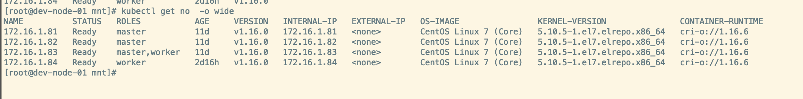
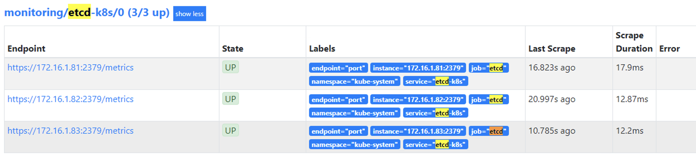
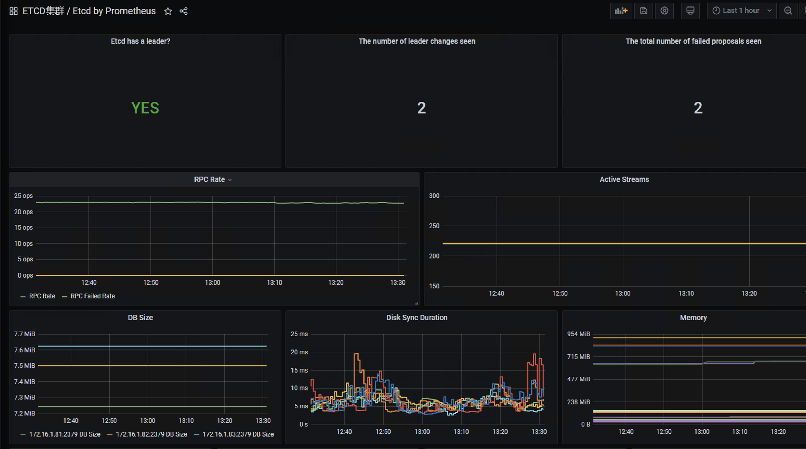
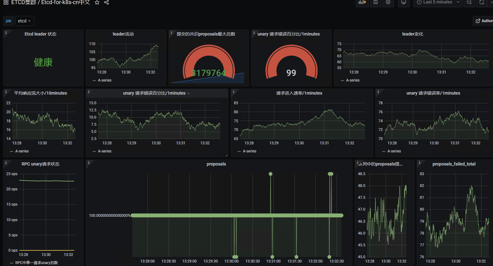

# Prometheus Operator 监控ETCD集群

## 1.背景

除了prometheus operator自带的资源对象，节点以及组件监控，有的时候实际的业务场景需要我们自定义监控项

- 确保有metric数据
- 创建ServiceMonitor对象，用于添加Prometheus添加监控项
- ServiceMonitor关联metrics数据接口的一个Service对象
- 确保Service可以正确获取到metrics

**本ETCD采用二进制部署的集群**



## 2.获取ETCD证书

对于etcd集群，在搭建的时候我们就采用了https证书认证的方式，所以这里如果想用Prometheus访问到etcd集群的监控数据，就需要添加证书。

**如果是k8s方式部署的etcd 可以用kubectl get pod etcd-master -n kube-system -o yaml查找**

我们可以通过`systemctl status etcd`查看证书路径

```
[root@dev-node-01 mnt]# systemctl status etcd
● etcd.service - Etcd Service
   Loaded: loaded (/usr/lib/systemd/system/etcd.service; enabled; vendor preset: disabled)
   Active: active (running) since Fri 2021-01-15 23:00:09 CST; 1 weeks 4 days ago
     Docs: https://coreos.com/etcd/docs/latest/
 Main PID: 4236 (etcd)
   CGroup: /system.slice/etcd.service
           └─4236 /usr/local/bin/etcd --config-file=/etc/etcd/etcd.config.yml

...
[root@dev-node-01 mnt]# cat /usr/lib/systemd/system/etcd.service
[Unit]
Description=Etcd Service
Documentation=https://coreos.com/etcd/docs/latest/
After=network.target

[Service]
Type=notify
ExecStart=/usr/local/bin/etcd \
  --config-file=/etc/etcd/etcd.config.yml #看次配置文件
Restart=on-failure
RestartSec=10
LimitNOFILE=65536

....


[root@dev-node-01 mnt]# cat /etc/etcd/etcd.config.yml
name: 'dev-node-01'
data-dir: /var/lib/etcd
wal-dir: /var/lib/etcd/wal
auto-compaction-mode: periodic
auto-compaction-retention: "1"
snapshot-count: 5000
heartbeat-interval: 100
election-timeout: 1000
quota-backend-bytes: 0
listen-peer-urls: 'https://172.16.1.81:2380'
listen-client-urls: 'https://172.16.1.81:2379,http://127.0.0.1:2379' #客户端监听地址
max-snapshots: 3
max-wals: 5
cors:
initial-advertise-peer-urls: 'https://172.16.1.81:2380'
advertise-client-urls: 'https://172.16.1.81:2379'
discovery:
discovery-fallback: 'proxy'
discovery-proxy:
discovery-srv:
initial-cluster: 'dev-node-01=https://172.16.1.81:2380,dev-node-02=https://172.16.1.82:2380,dev-node-03=https://172.16.1.83:2380'
initial-cluster-token: 'etcd-k8s-cluster'
initial-cluster-state: 'new'
strict-reconfig-check: false
enable-v2: true
enable-pprof: true
proxy: 'off'
proxy-failure-wait: 5000
proxy-refresh-interval: 30000
proxy-dial-timeout: 1000
proxy-write-timeout: 5000
proxy-read-timeout: 0
client-transport-security:
  ca-file: '/etc/kubernetes/pki/etcd/ca.crt'#这些就是要的正式了 
  cert-file: '/etc/kubernetes/pki/etcd/server.crt'
  key-file: '/etc/kubernetes/pki/etcd/server.key'
  client-cert-auth: true
  trusted-ca-file: '/etc/kubernetes/pki/etcd/ca.crt'
  auto-tls: true
peer-transport-security:
  ca-file: '/etc/kubernetes/pki/etcd/ca.crt'
  cert-file: '/etc/kubernetes/pki/etcd/peer.crt'
  key-file: '/etc/kubernetes/pki/etcd/peer.key'
  peer-client-cert-auth: true
  trusted-ca-file: '/etc/kubernetes/pki/etcd/ca.crt'
```

## 3.保存证书到prometheus

接下来我们需要创建一个secret，让prometheus pod节点挂载

```shell
[root@dev-node-01 mnt]# kubectl create secret generic etcd-ssl --from-file=/etc/kubernetes/pki/etcd/ca.crt  --from-file=/etc/kubernetes/pki/etcd/server.crt --from-file=/etc/kubernetes/pki/etcd/server.key -n monitoring
secret/etcd-ssl created
[root@dev-node-01 mnt]# kubectl describe secrets -n monitoring etcd-ssl
Name:         etcd-ssl
Namespace:    monitoring
Labels:       <none>
Annotations:  <none>

Type:  Opaque

Data
====
server.key:  1675 bytes
ca.crt:      1029 bytes
server.crt:  1237 bytes
```

将etcd-ssl secret对象配置到prometheus资源对象中

```
1.通过edit直接编辑prometheus
kubectl edit prometheus k8s -n monitoring

2.修改prometheus.yaml文件
vim kube-prometheus-master/manifests/prometheus-prometheus.yaml
  nodeSelector:
    beta.kubernetes.io/os: linux
  replicas: 2
  #添加secret名称
  secrets:
  - etcd-ssl 
```

进入pod查看证书

```shell
[root@dev-node-01 mnt]# kubectl exec -it -n monitoring prometheus-k8s-0 /bin/sh
Defaulting container name to prometheus.
Use 'kubectl describe pod/prometheus-k8s-0 -n monitoring' to see all of the containers in this pod.
/prometheus $ ls /etc/prometheus/secrets/etcd-ssl/
ca.crt      server.crt  server.key
```

## 4.创建Service

ServiceMonitor创建完成，但是还没有关联对应的Service对象，所以需要创建一个service对象

```
[root@dev-node-01 mnt]# cat etcd-prometheus-svc.yaml 
apiVersion: v1
kind: Service
metadata:
  name: etcd-k8s
  namespace: kube-system
  labels:
    k8s-app: etcd
spec:
  type: ClusterIP
  clusterIP: None
  ports:
  - name: port
    port: 2379
    protocol: TCP

---
apiVersion: v1
kind: Endpoints
metadata:
  name: etcd-k8s
  namespace: kube-system
  labels:
    k8s-app: etcd
subsets:
- addresses:
  - ip: 172.16.1.81     #etcd节点名称
    nodeName: 172.16.1.81     #kubelet名称 (kubectl get node)显示的名称
  - ip: 172.16.1.82
    nodeName: 172.16.1.82
  - ip: 172.16.1.83
    nodeName: 172.16.1.83
  ports:
  - name: port
    port: 2379
    protocol: TCP
    
[root@dev-node-01 mnt]# kubectl apply -f etcd-prometheus-svc.yaml
service/etcd-k8s configured
endpoints/etcd-k8s configured
[root@dev-node-01 mnt]# kubectl describe secrets -n monitoring etcd-ssl
Name:         etcd-ssl
Namespace:    monitoring
Labels:       <none>
Annotations:  <none>

Type:  Opaque

Data
====
server.crt:  1237 bytes
server.key:  1675 bytes
ca.crt:      1029 bytes
```

## 5.创建ServiceMonitor

目前prometheus已经挂载了etcd的证书文件，接下来需要创建ServiceMonitor

```
[root@dev-node-01 mnt]# kubectl apply -f etcd-servicemonitor.yaml
servicemonitor.monitoring.coreos.com/etcd-k8s created
[root@dev-node-01 mnt]# cat  etcd-servicemonitor.yaml 
apiVersion: monitoring.coreos.com/v1
kind: ServiceMonitor
metadata:
  name: etcd-k8s
  namespace: monitoring
  labels:
    k8s-app: etcd-k8s
spec:
  jobLabel: k8s-app
  endpoints:
  - port: port
    interval: 30s
    scheme: https
    #证书路径 (在prometheus pod里路径)
    tlsConfig:
      caFile: /etc/prometheus/secrets/etcd-ssl/ca.crt
      certFile: /etc/prometheus/secrets/etcd-ssl/server.crt
      keyFile: /etc/prometheus/secrets/etcd-ssl/server.key
      insecureSkipVerify: true
    #可选配置重新打标
    relabelings:
    - action: replace
      regex: (.*):(.*) #正则匹配源lable的value并分组
      replacement: $1 #匹配的组1作为目标lable的Value
      sourceLabels: #源lable的Key
      - __address__
      targetLabel: ip #目标lable的key
    - action: replace
      regex: (.*):(.*)
      replacement: $2
      sourceLabels:
      - __address__
      targetLabel: port
  selector:
    matchLabels:
      k8s-app: etcd
  namespaceSelector:
    matchNames:
    - kube-system
[root@dev-node-01 mnt]# kubectl apply -f etcd-servicemonitor.yaml
servicemonitor.monitoring.coreos.com/etcd-k8s created

[root@dev-node-01 mnt]# kubectl get ServiceMonitor -n monitoring
NAME                      AGE
alertmanager              10d
coredns                   10d
etcd-k8s                  104s
grafana                   10d
kube-apiserver            10d
kube-controller-manager   10d
kube-ovn-cni              16h
kube-ovn-controller       16h
kube-ovn-monitor          16h
kube-ovn-pinger           16h
kube-scheduler            10d
kube-state-metrics        10d
kubelet                   10d
node-exporter             10d
prometheus                10d
prometheus-operator       10d
```

创建完成后，稍等一会我们可以去prometheus ui界面查看targets，便会出现etcd监控信息



数据采集完成后，接下来可以在grafana中导入dashboard

https://grafana.com/grafana/dashboards/3070

还可以导入中文版ETCD集群插件

https://grafana.com/grafana/dashboards/9733



