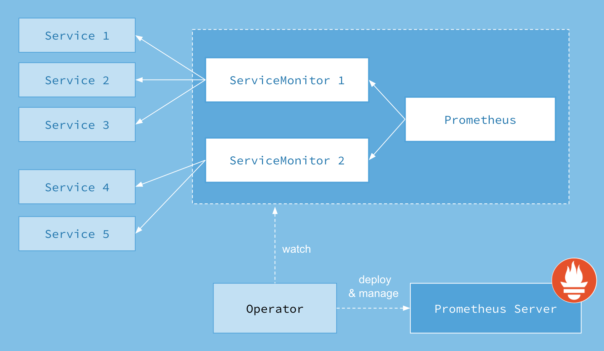
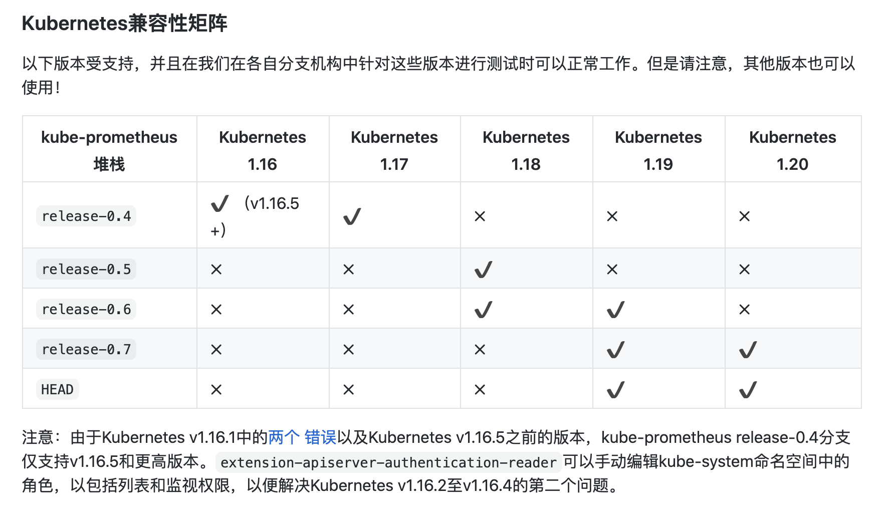

# 高级部署 Prometheus Operator 框架

[GitHub 地址](https://github.com/prometheus-operator/kube-prometheus)

## Operator

`Operator`是由[CoreOS](https://coreos.com/)公司开发的，用来扩展 Kubernetes API，特定的应用程序控制器，它用来创建、配置和管理复杂的有状态应用，如数据库、缓存和监控系统。`Operator`基于 Kubernetes 的资源和控制器概念之上构建，但同时又包含了应用程序特定的一些专业知识，比如创建一个数据库的`Operator`，则必须对创建的数据库的各种运维方式非常了解，创建`Operator`的关键是`CRD`（自定义资源）的设计。

> `CRD`是对 Kubernetes API 的扩展，Kubernetes 中的每个资源都是一个 API 对象的集合，例如我们在YAML文件里定义的那些`spec`都是对 Kubernetes 中的资源对象的定义，所有的自定义资源可以跟 Kubernetes 中内建的资源一样使用 kubectl 操作。

`Operator`是将运维人员对软件操作的知识给代码化，同时利用 Kubernetes 强大的抽象来管理大规模的软件应用。目前`CoreOS`官方提供了几种`Operator`的实现，其中就包括我们今天的主角：`Prometheus Operator`，`Operator`的核心实现就是基于 Kubernetes 的以下两个概念：

- 资源：对象的状态定义
- 控制器：观测、分析和行动，以调节资源的分布

当然我们如果有对应的需求也完全可以自己去实现一个`Operator`，接下来我们就来给大家详细介绍下`Prometheus-Operator`的使用方法。

## 介绍

首先我们先来了解下`Prometheus-Operator`的架构图：



上图是`Prometheus-Operator`官方提供的架构图，其中`Operator`是最核心的部分，作为一个控制器，他会去创建`Prometheus`、`ServiceMonitor`、`AlertManager`以及`PrometheusRule`4个`CRD`资源对象，然后会一直监控并维持这4个资源对象的状态。

其中创建的`prometheus`这种资源对象就是作为`Prometheus Server`存在，而`ServiceMonitor`就是`exporter`的各种抽象，`exporter`前面我们已经学习了，是用来提供专门提供`metrics`数据接口的工具，`Prometheus`就是通过`ServiceMonitor`提供的`metrics`数据接口去 pull 数据的，当然`alertmanager`这种资源对象就是对应的`AlertManager`的抽象，而`PrometheusRule`是用来被`Prometheus`实例使用的报警规则文件。

这样我们要在集群中监控什么数据，就变成了直接去操作 Kubernetes 集群的资源对象了，是不是方便很多了。上图中的 Service 和 ServiceMonitor 都是 Kubernetes 的资源，一个 ServiceMonitor 可以通过 labelSelector 的方式去匹配一类 Service，Prometheus 也可以通过 labelSelector 去匹配多个ServiceMonitor。

## 安装

我们这里直接通过 Prometheus-Operator 的源码来进行安装，当然也可以用 Helm 来进行一键安装，我们采用源码安装可以去了解更多的实现细节。根据版本匹配将源码 Clone 下来：

最新的版本官方将资源https://github.com/coreos/prometheus-operator/tree/master/contrib/kube-prometheus迁移到了独立的 git 仓库中：https://github.com/coreos/kube-prometheus.git



进入到 manifests 目录下面，这个目录下面包含我们所有的资源清单文件，我们需要对其中的文件 prometheus-serviceMonitorKubelet.yaml 进行简单的修改。通常是不需要修改的

```shell
git clone https://github.com/prometheus-operator/kube-prometheus.git
kubectl create -f manifests/setup
until kubectl get servicemonitors --all-namespaces ; do date; sleep 1; echo ""; done
kubectl create -f manifests/
```

部署完成后，会创建一个名为`monitoring`的 namespace，所以资源对象对将部署在改命名空间下面，此外 Operator 会自动创建4个 CRD 资源对象：

```
[root@dev-node-01 ~]#  kubectl get crd |grep coreos
alertmanagers.monitoring.coreos.com                   2021-01-16T00:09:46Z
podmonitors.monitoring.coreos.com                     2021-01-16T13:52:30Z
prometheuses.monitoring.coreos.com                    2021-01-16T00:09:46Z
prometheusrules.monitoring.coreos.com                 2021-01-16T00:09:46Z
servicemonitors.monitoring.coreos.com                 2021-01-16T00:09:46Z
```

可以在 monitoring 命名空间下面查看所有的 Pod，其中 alertmanager 和 prometheus 是用 StatefulSet 控制器管理的，其中还有一个比较核心的 prometheus-operator 的 Pod，用来控制其他资源对象和监听对象变化的：

```
[root@dev-node-01 ~]# kubectl get pods -n monitoring
NAME                                   READY   STATUS      RESTARTS   AGE
alertmanager-main-0                    2/2     Running     0          10d
alertmanager-main-1                    2/2     Running     0          27h
alertmanager-main-2                    2/2     Running     0          23h
grafana-6db6495d8c-ctbkn               1/1     Running     0          6h42m
grafana-chown-ns8fg                    0/1     Completed   0          8d
kube-state-metrics-765c7c7f95-tndqd    3/3     Running     0          10d
node-exporter-494nb                    2/2     Running     0          29h
node-exporter-dtns5                    2/2     Running     0          10d
node-exporter-qm278                    2/2     Running     0          10d
node-exporter-vrln5                    2/2     Running     0          10d
prometheus-adapter-5cd5798d96-skrn9    1/1     Running     0          10d
prometheus-k8s-0                       3/3     Running     0          5h32m
prometheus-k8s-1                       3/3     Running     0          5h34m
prometheus-operator-6bb66f6544-69m2m   1/1     Running     0          8d
```

可以看到上面针对 grafana 和 prometheus 都创建了一个类型为 ClusterIP 的 Service，当然如果我们想要在外网访问这两个服务的话可以通过创建对应的 Ingress 对象或者使用 NodePort 类型的 Service，我们这里为了简单，直接使用 NodePort 类型的服务即可，编辑 grafana 和 prometheus-k8s 这两个 Service，将服务类型更改为 NodePort:

```shell
[root@dev-node-01 ~]# kubectl edit svc grafana -n monitoring
[root@dev-node-01 ~]# kubectl edit svc prometheus-k8s -n monitoring
[root@dev-node-01 ~]# kubectl edit svc alertmanager-main -n monitoring
[root@dev-node-01 ~]# kubectl get svc -n monitoring |grep NodePort
alertmanager-main       NodePort    10.109.28.129    <none>        9093:31626/TCP               10d
grafana                 NodePort    10.97.226.39     <none>        3000:31957/TCP               10d
prometheus-k8s          NodePort    10.109.210.137   <none>        9090:31448/TCP               10d
```

## 配置

分析一下官方的服务发现配置，比如 kube-controller-manager 和 kube-scheduler 这两个系统组件，这就和 ServiceMonitor 的定义有关系了，我们先来查看下 kube-scheduler 组件对应的 ServiceMonitor 资源的定义：(prometheus-serviceMonitorKubeScheduler.yaml)

```yaml
apiVersion: monitoring.coreos.com/v1
kind: ServiceMonitor
metadata:
  labels:
    k8s-app: kube-scheduler #prometheus默认通过 k8s-app: kube-scheduler发现ServiceMonitor，只要写上这个标签prometheus服务就能发现这个ServiceMonitor
  name: kube-scheduler
  namespace: monitoring
spec:
  endpoints:
  - interval: 30s # 每30s获取一次信息
    port: http-metrics  # 对应service的端口名
  jobLabel: k8s-app #jobLabel指定的标签的值将会作为prometheus配置文件中scrape_config下job_name的值，也就是Target，如果不写，默认为service的name
  namespaceSelector: # 表示去匹配某一命名空间中的service，如果想从所有的namespace中匹配用any: true
    matchNames:
    - kube-system
  selector:  # 匹配的 Service 的labels，如果使用mathLabels，则下面的所有标签都匹配时才会匹配该service，如果使用matchExpressions，则至少匹配一个标签的service都会被选择
    matchLabels:
      k8s-app: kube-scheduler
```

上面我们通过`selector.matchLabels`在 kube-system 这个命名空间下面匹配具有`k8s-app=kube-scheduler`这样的 Service.

**更高级的自动化发现配置**https://www.qikqiak.com/post/prometheus-operator-advance/


## 持久化存储

- 配置prometheus持久化存储

```shell
[root@dev-node-01 manifests]# vim prometheus-prometheus.yaml
apiVersion: monitoring.coreos.com/v1
kind: Prometheus
metadata:
  labels:
    prometheus: k8s
  name: k8s
  namespace: monitoring
spec:
  alerting:
    alertmanagers:
    - name: alertmanager-main
      namespace: monitoring
      port: web
  #-------------------
  storage: #配置持久化存储
    volumeClaimTemplate:
      spec:
        storageClassName: sc-ceph-rbd
        resources:
          requests:
            storage: 10Gi
  #-------------------      
  baseImage: quay.io/prometheus/prometheus
  nodeSelector:
    kubernetes.io/os: linux
  podMonitorNamespaceSelector: {}
  podMonitorSelector: {}
  replicas: 2
  resources:
    requests:
      memory: 400Mi
  ruleSelector:
    matchLabels:
      prometheus: k8s
      role: alert-rules
  securityContext:
    fsGroup: 2000
    runAsNonRoot: true
    runAsUser: 1000
  serviceAccountName: prometheus-k8s
  serviceMonitorNamespaceSelector: {}
  serviceMonitorSelector: {}
  version: v2.11.0
```

- 配置grafana持久化存储

  Grafana 版本大于5.1的部署过程中错误是`/var/lib/grafana`目录的权限问题，这还是因为5.1版本后 groupid 更改了引起的问题，我们这里增加了`securityContext`，但是我们将目录`/var/lib/grafana`挂载到 pvc 这边后目录的拥有者并不是上面的 grafana(472)这个用户了，所以我们需要更改下这个目录的所属用户，这个时候我们可以利用一个 Job 任务去更改下该目录的所属用户：（grafana-chown-job.yaml）

```shell
[root@dev-node-01 manifests]# cat grafana-pvc.yaml
---
kind: PersistentVolumeClaim
apiVersion: v1
metadata:
  name: grafana-storage-pv
  namespace: monitoring
spec:
  accessModes:
    - ReadWriteOnce
  storageClassName: sc-ceph-rbd
  resources:
    requests:
      storage: 5Gi
---
apiVersion: batch/v1
kind: Job
metadata:
  name: grafana-chown
  namespace: monitoring
spec:
  template:
    spec:
      restartPolicy: Never
      containers:
      - name: grafana-chown
        command: ["chown", "-R", "472:472", "/var/lib/grafana"]
        image: busybox
        imagePullPolicy: IfNotPresent
        volumeMounts:
        - name: grafana-storage
          subPath: grafana
          mountPath: /var/lib/grafana
      volumes:
      - name:  grafana-storage
        persistentVolumeClaim:
          claimName: grafana-storage-pv
```

- 先执行挂载卷权限修改任务

```
kubectl apply -f  grafana-pvc.yaml
```

- 再去创建Grafana 

```shell
[root@dev-node-01 manifests]# cat grafana-deployment.yaml
      ......
      securityContext:
        runAsUser: 472
        fsGroup: 472      
      .....
      volumes:
      #- emptyDir: {}
      #  name: grafana-storage
      - name: grafana-storage
        persistentVolumeClaim:
          claimName: grafana-storage-pv 
```

```
[root@dev-node-01 manifests]# kubectl get pvc -n monitoring
NAME                                 STATUS   VOLUME                                     CAPACITY   ACCESS MODES   STORAGECLASS   AGE
grafana-storage-pv                   Bound    pvc-1a7a1e69-2fa5-47ee-8bcf-c5308bf6bced   5Gi        RWO            sc-ceph-rbd    8d
prometheus-k8s-db-prometheus-k8s-0   Bound    pvc-4ca8403c-dcb2-41e9-a0cf-d42ea2291c75   10Gi       RWO            sc-ceph-rbd    8d
prometheus-k8s-db-prometheus-k8s-1   Bound    pvc-b4a34900-7583-43a8-a015-96ea0af2d299   10Gi       RWO            sc-ceph-rbd    8d
```

